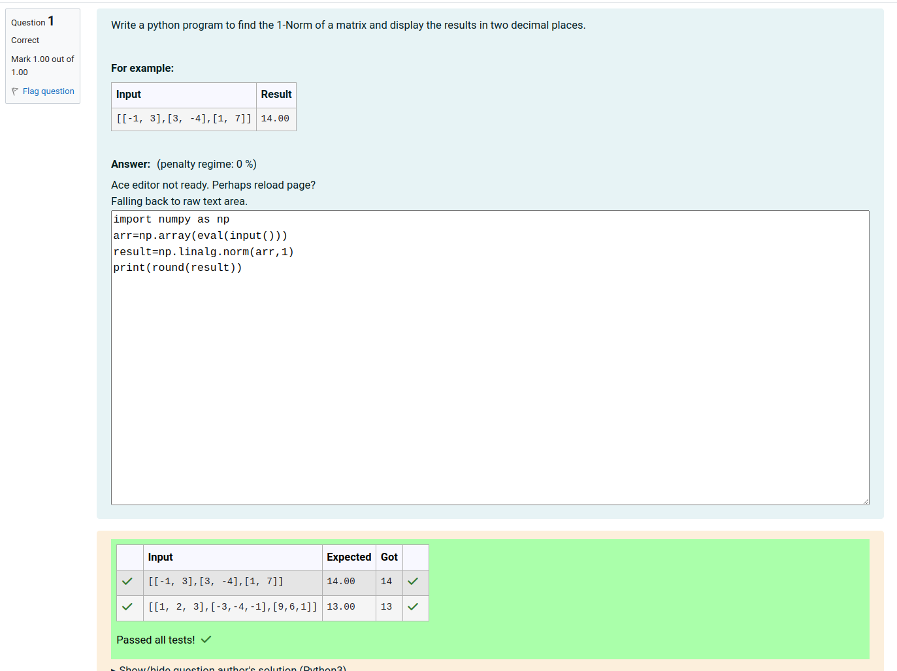
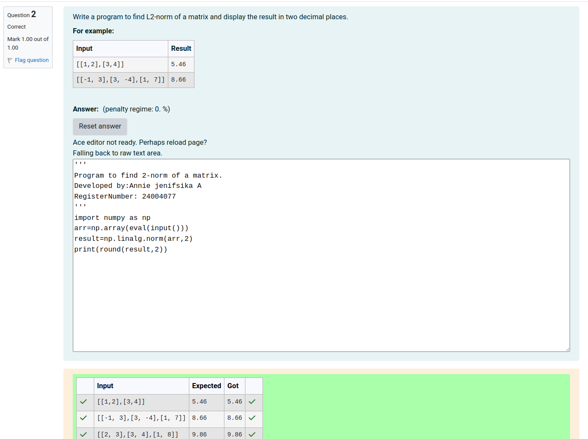
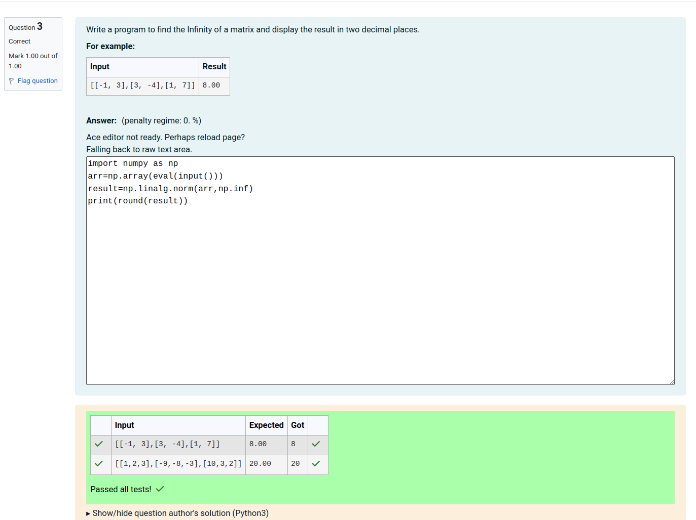

# Norm of a matrix
## Aim
To write a program to find the 1-norm, 2-norm and infinity norm of the matrix and display the result in two decimal places.
## Equipment’s required:
1.	Hardware – PCs
2.	Anaconda – Python 3.7 Installation / Moodle-Code Runner
## Algorithm:

Program 1
	
	1. Get the input matrix using np.array()   
    
	2. Find the 1-norm of the matrix using np.linalg.norm()
	
	3. Print the norm of the matrix in two decimal places.

Program 2
    
	1. Get the input matrix using np.array()   
    
	2. Find the 2-norm of the matrix using np.linalg.norm()
	
	3. Print the norm of the matrix in two decimal places.

Program 3
    
	1. Get the input matrix using np.array()   
    
	2. Find the infinity-norm of the matrix using np.linalg.norm()
	
	3. Print the norm of the matrix in two decimal places.


## Program:
```Python
# Register No:24004077
# Developed By:Annie jenifsika A
# 1-Norm of a Matrix
import numpy as np
arr=np.array(eval(input()))
result=np.linalg.norm(arr,1)
print(round(result))

# 2-Norm of a Matrix
'''
Program to find 2-norm of a matrix.
Developed by:Annie jenifsika A
RegisterNumber: 24004077
'''
import numpy as np
arr=np.array(eval(input()))
result=np.linalg.norm(arr,2)
print(round(result,2))


# Infinity Norm of a Matrix
import numpy as np
arr=np.array(eval(input()))
result=np.linalg.norm(arr,np.inf)
print(round(result))


```
## Output:
### 1-Norm of a Matrix
<br>
<br>
<br>

### 2-Norm of a Matrix
<br>
<br>
<br>

### Infinity Norm of a Matrix
<br>
<br>
<br>

## Result
Thus the program for 1-norm, 2-norm and Infinity norm of a matrix are written and verified.
